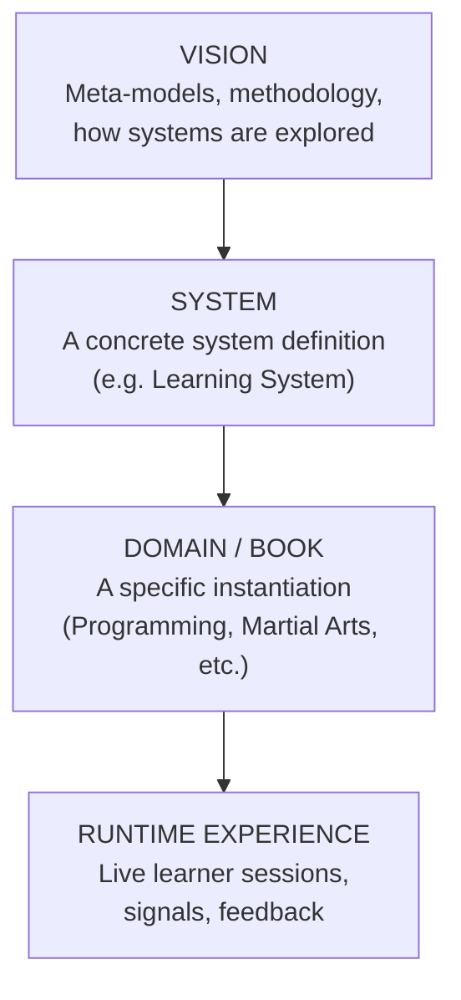
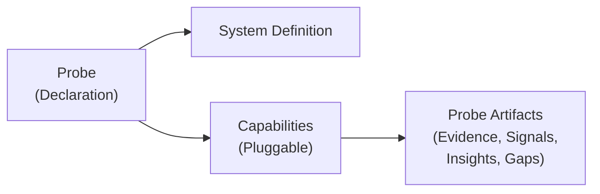
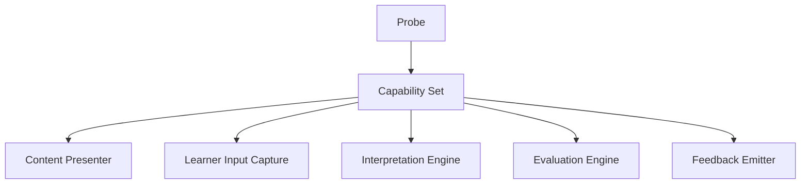
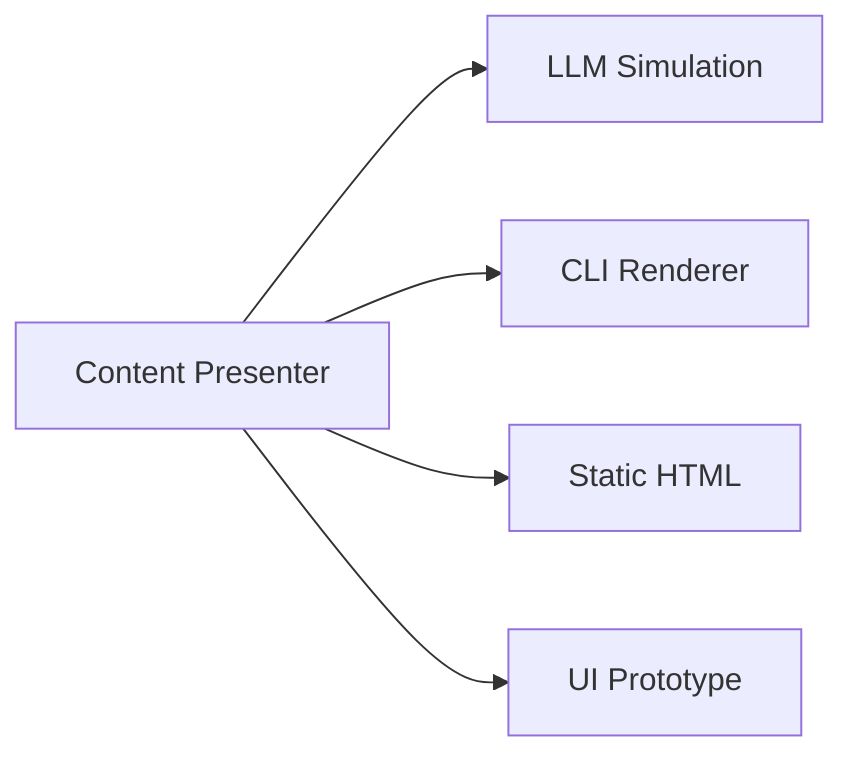
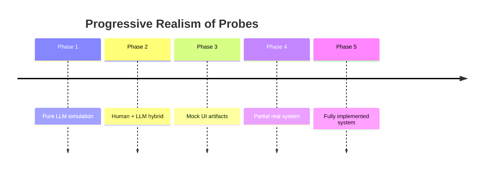
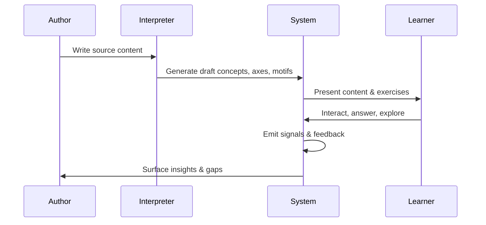
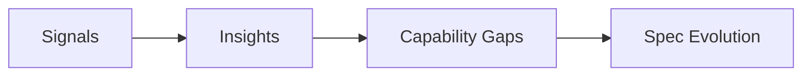

# Architecture Overview

This document explains the conceptual architecture of the project.

It is **not an implementation guide**.
It describes:
- the levels of abstraction
- how probes work
- how systems are explored and evolved
- how tooling gradually emerges

The goal is to make the project understandable, extensible, and evolvable.

# Levels of Abstraction

Explanation

* Vision defines how systems are described, explored, and evolved.
* System defines what exists in a given system (entities, axes, workflows).
* Domain / Book instantiates the system with real content.
* Runtime Experience is the live execution with real users.

# What a Probe Is

A probe is an executable experiment over a system.
It is not content, not tooling, and not a test.

## Key idea

A probe:
* declares what is being explored
* declares which capabilities are required
* produces structured artifacts

It can run **without a real product**.

# Capabilities: Progressive Concretization

Capabilities are **replaceable execution surfaces**.
They are defined by contract, not implementation.

Each capability may have multiple implementations:

The probe **does not** care which one is used.

# Wizard-of-Oz → System Evolution

The same probe can run at increasing levels of realism.

This allows:
* early discovery
* cheap failure
* gradual commitment

# Example: Author → Learner → System Flow

This closes the loop **without requiring a finished platform**.

# Capability Gaps & Insights

Probes produce **structured findings**, not opinions.

A capability gap means:

> “To run this probe faithfully, the system needs a capability it doesn’t yet have.”

This guides __what to build next__, without premature implementation.

